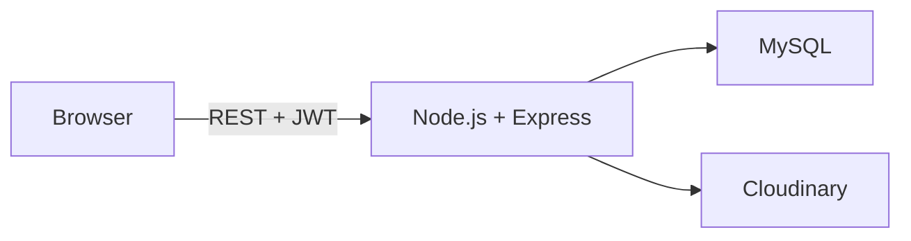
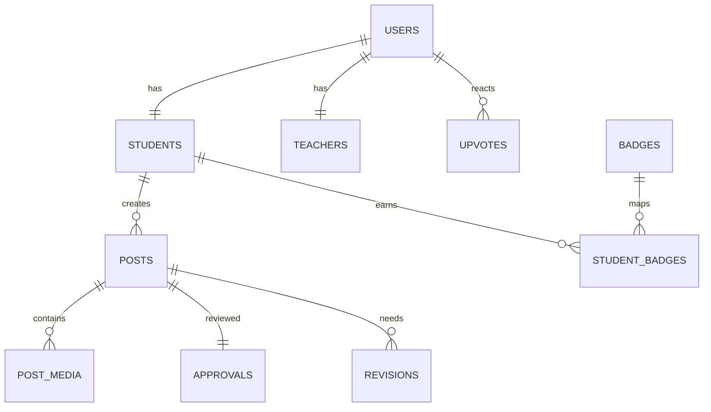

# Student Professional Portfolio & Teacher Approval Platform

A LinkedIn-inspired academic platform where student achievements become public after teacher review.

## Architecture

## ER Diagram

## Local Setup

### Backend

1. `cd backend`
2. `npm install`
3. Create `.env` from `backend/.env.example`
4. `npm run dev`

### Frontend

1. Serve `frontend/` with any static server.
2. Update `frontend/js/config.js` to point to backend URL.

## Scripts

- Backend: `npm run dev` or `npm start`

## Documentation

- API documentation: [API_DOCS.md](API_DOCS.md)
- Deployment steps: [DEPLOYMENT.md](DEPLOYMENT.md)

## Notes

- Reports export use `/api/reports/pdf` and `/api/reports/excel`.
- File uploads use Cloudinary by default.
